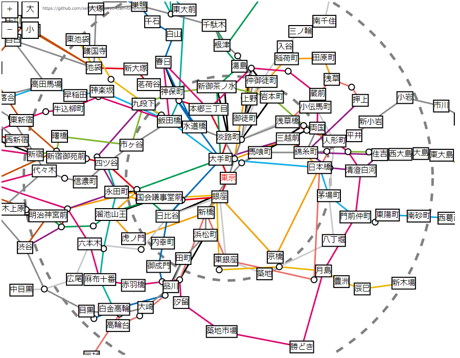

# Tokyo Train Time Map
東京の電車は、どこへ行くにも30分かかるという呟きを昔どこかで見たので、本当にそうなのか確かめられる地図を作成しました。

地図の中心となる駅を選択すると、そこから各駅への所要時間を画面上の距離として表現します。



平面上に駅を表示する都合上、中心駅以外の駅同士の所要時間は正しく表現されないのでご注意ください。

対応路線
- 東京メトロ各線
- 都営地下鉄各線
- JR山手線・中央線・総武線(三鷹～津田沼)

2017年7月時点の情報に基づきます。

中心駅と各駅の表示角度設定のために、駅の緯度経度情報を用いています。以前[parosky.net](http://parosky.net/)で配布されていたものを利用していますが、現在リンク切れのようです。

データ例
```
4号線丸ノ内線,東京地下鉄,後楽園,139.75008,35.70728,139.75164,35.70734
4号線丸ノ内線,東京地下鉄,御茶ノ水,139.76355,35.70017,139.76526,35.70069
4号線丸ノ内線,東京地下鉄,本郷三丁目,139.7595,35.70613,139.76077,35.70728
```
