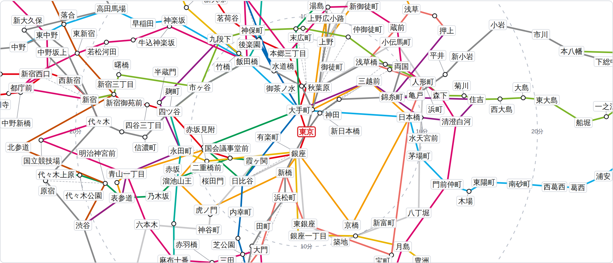

# Tokyo Train Time Map

東京の電車は、どこへ行くにも30分かかるという呟きを昔どこかで見たので、本当にそうなのか確かめられる地図を作成しました。

地図の中心となる駅を選択すると、そこから各駅への所要時間を画面上の距離として表現します。
**方角は実際の地理どおり、中心からの距離は所要時間**です。同心円は10分刻みの目盛です。



→ **https://select766.github.io/tokyo-train-time-map/**

## 使い方

- 駅名をクリック（タップ）すると、その駅が中心になります
- 上部の入力欄から駅名で検索できます
- ホイール・ピンチで拡大縮小、ドラッグで移動
- 「全体表示」で到達可能な全駅が収まる倍率に戻ります
- 中心駅は URL に入るので、そのまま共有できます（例: `?center=新宿`）

画面下部に「中心駅から30分以内に何駅あるか」を表示します。冒頭の呟きの答えです。
たとえば東京駅からは対象248駅のうち218駅（88%）が30分以内に入ります。

## おまけモード

「おまけモード」ボタンから、**まだ開業していない計画中・建設中の路線**を地図に足せます。
未開業路線は破線で描かれます。

| 路線 | 区間 | 状況 |
| --- | --- | --- |
| 都心部・臨海地域地下鉄 | 東京〜有明（新銀座・新築地・勝どき・晴海・豊洲市場） | 2040年頃の開業を目指す計画 |
| 有楽町線延伸（豊住線） | 豊洲〜住吉（枝川・千石） | 2024年着工、2030年代半ば開業予定 |

臨海地下鉄ができると東京駅からの見え方がはっきり変わります。

| 区間 | 現在 | おまけモード |
| --- | --- | --- |
| 東京→勝どき | 18分 | **7分** |
| 銀座→勝どき | 20分 | **14分** |
| 豊洲→住吉 | 20分 | **9分** |
| 豊洲→東陽町 | 17分 | **5分** |

駅の位置も駅間所要時間も公表資料からのおおまかな値です。「開業したらこのくらい近くなる」
という目安として見てください。状態は URL に入ります（`?extra=rinkai,toyosumi`）。

## 注意

平面上に駅を表示する都合上、**中心駅以外の駅同士の所要時間は正しく表現されません**。

乗換・徒歩連絡は一律5分として計算しています。実際の乗換時間や待ち時間は反映していません。

## 対応路線

- 東京メトロ各線
- 都営地下鉄各線
- JR山手線・中央総武線（三鷹〜津田沼）

計248駅。所要時間は2017年7月時点の各社公開時刻表に基づきます。
その後に開業した以下の2駅を2026年7月に追補しました（所要時間は現行ダイヤで確認）。

| 駅 | 路線 | 開業 | 駅間所要時間 |
| --- | --- | --- | --- |
| 虎ノ門ヒルズ | 日比谷線 | 2020-06-06 | 神谷町 1分 / 霞ケ関 2分 |
| 高輪ゲートウェイ | 山手線 | 2020-03-14 | 田町 2分 / 品川 2分 |

## データ

`data/` 以下の CSV が唯一の入力です。`npm run dataset` で `public/data/network.json` を生成します。

| ファイル | 内容 |
| --- | --- |
| `lines.csv` | 路線の一覧と路線色 |
| `stations.csv` | 路線ごとの駅の並びと駅間所要時間 |
| `walk.csv` | 名前が違うが徒歩で乗り換えられる駅の組 |
| `station_locations.csv` | 駅の緯度経度 |
| `extra_groups.csv` | おまけモードで切り替えられる路線グループ |
| `through_services.csv` | 直通運転で乗換時間がかからない路線の組 |

`lines.csv` の「おまけ」列にグループ id を書くと、その路線はおまけモード扱いになります。

作成方法の詳細は `data/note.txt` を参照してください。

初版は駅の緯度経度を parosky.net で配布されていたデータから取得していましたが、
現在リンク切れのため、生成済みデータから復元して `station_locations.csv` にまとめました。
新設2駅の座標は Wikipedia から取得しています。

### 今後のデータ更新について

所要時間の元データが古いため、[公共交通オープンデータセンター](https://www.odpt.org/)（ODPT）の
時刻表データへの置き換えを予定しています。調査結果と移行計画は `tasks/todo.md` にあります。
要点は次のとおりです。

- 東京メトロ・都営地下鉄は**恒久ライセンス**で提供されており、時刻表から駅間所要時間を自動生成できる
- 一方 **JR東日本は「チャレンジ限定ライセンス」のみ**で、2027-03-14 に許諾が終了しデータ削除義務がある。
  そのため JR 部分は当面この手動 CSV を維持します

## 開発

```bash
npm install
npm run dev        # 開発サーバ
npm run build      # 本番ビルド (dist/)
npm test           # ユニットテスト (Vitest)
npm run e2e        # E2E・視覚確認 (Playwright)
npm run lint
npm run typecheck
```

初回のみ Playwright のブラウザ取得が必要です。

```bash
npx playwright install chromium
```

### 構成

| ディレクトリ | 役割 |
| --- | --- |
| `data/` | 手書きの CSV データ（唯一の入力） |
| `tools/build-dataset.ts` | CSV → `network.json` の変換 |
| `src/routing/` | 二分ヒープつきダイクストラ法 |
| `src/layout/` | 極座標配置とラベルの重なり解消 |
| `src/render/` | SVG 描画・パン・ズーム・アニメーション |
| `src/ui/` | Preact による UI |
| `tests/` | Vitest のユニットテストと Playwright の E2E |

Vite + TypeScript + Preact。実行時の依存は Preact のみで、ビルド成果物は gzip 後 13KB 程度です。

## ライセンス

MIT License（`LICENSE` を参照）
